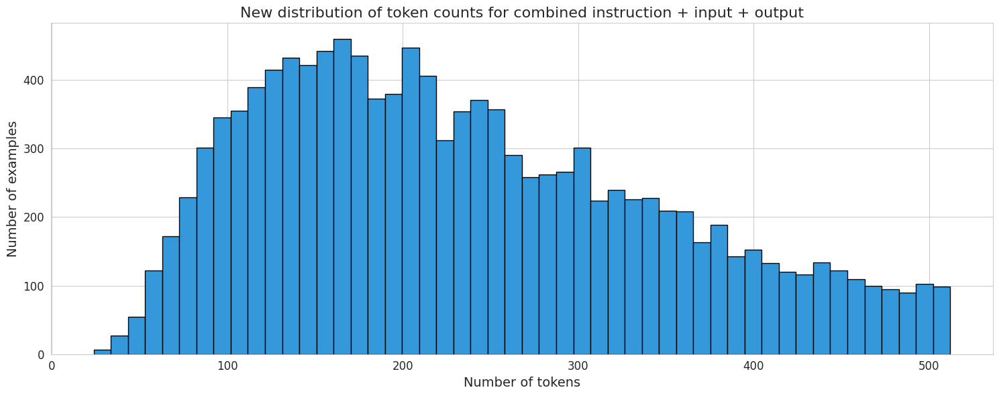

# Processing QA Dataset

The dataset I used is open-source, and you can find it [here](https://huggingface.co/datasets/FinGPT/fingpt-fiqa_qa). Due to limited resources, I'll only be taking a subset of samples (around 2500). Let's get started! This notebook contains the steps for processing the dataset, including:

## 1. WordCloud
A WordCloud is a visualization of the most frequently appearing words in the dataset. It helps us understand the data by visualizing the most common words and also aids in removing irrelevant words.


## 2. Keyword Filtering
I used ChatGPT to create a list of the most popular or frequently appearing keywords in financial contexts such as investment, banking, stocks, and more. This aims to make the data more uniform so that the chatbot's response aligns with the context.

Example:
```python
# Investment
    'investment', 'investor', 'long-term investment', 'short-term investment'
    ...

# Banking
    'bank', 'banking', 'savings', 'savings account', 'loans', 'credit'
    ...

# Stocks
    'stock market', 'stock index', 'stock exchange', 'stock price', 'stock trading'
    ...

# And so on...
```

## 3. Token Distribution
Visualizing the distribution of each token (minimum, mean, maximum). We'll also remove outliers to balance the token distribution and facilitate the model training process.




## 4. Near-Deduplication Using Embeddings
The "Near-Deduplication Using Embeddings" technique in data processing refers to an approach to identifying and removing near-duplicate data using an embedding representation of that data.

## 5. Top-K Sampling
The method is used to obtain the top-k set of data based on the number of tokens appearing in the dataset. The technique used here is data processing by taking the top rows based on the number of tokens appearing in the dataset. In this case, we use the number of tokens as a metric to determine which rows to take. Using this method, we can take a subset of the dataset consisting of the top rows with the most tokens, allowing us to produce a more focused and meaningful dataset for further analysis or modeling.

## 6. Upload to HuggingFace (Optional)
You can also choose to upload the processed dataset to HuggingFace to share it with the community.