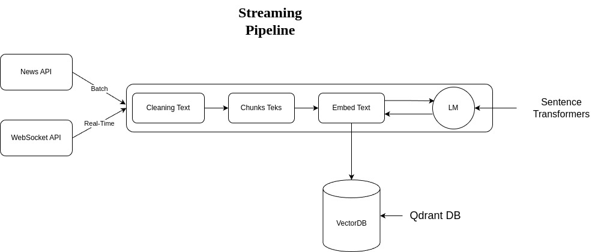

# Feature Pipeline


Real-time feature pipeline that:
- ingests financial news from [Alpaca](https://docs.alpaca.markets/docs/news-api)
- cleans & transforms the news documents into embeddings in real-time using [Bytewax](https://github.com/bytewax/bytewax?utm_source=thepauls&utm_medium=partner&utm_content=github)
- stores the embeddings into the [Qdrant Vector DB](https://qdrant.tech/?utm_source=thepauls&utm_medium=partner&utm_content=github)

The streaming pipeline is automatically deployed on an AWS EC2 machine using a CI/CD pipeline built in GitHub actions

## Usage for Development
----

- Prepare credentials:

    ```bash
    cp .env.example .env
    ```
- Replace your api and secret
    ```bash
    ALPACA_API_KEY="Your-api"
    ALPACA_SECRET_KEY="Your-Secret"
    ```